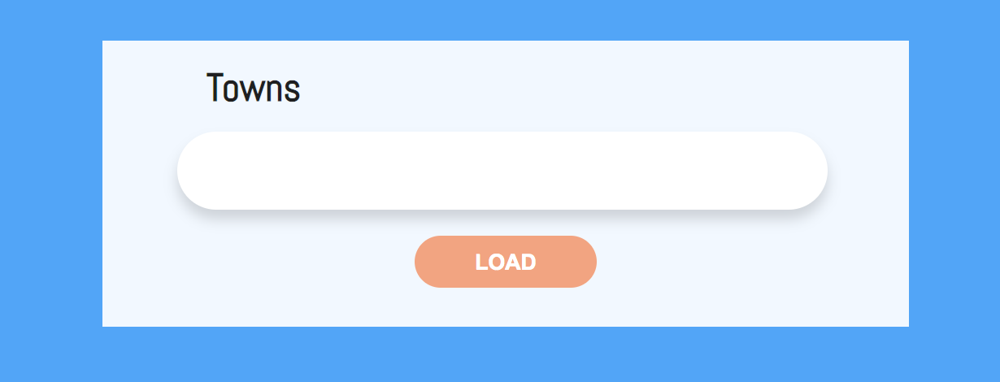
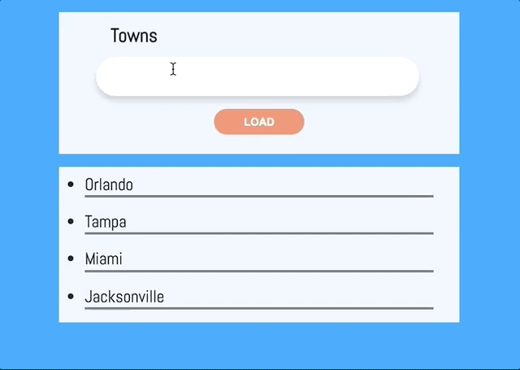

# list-towns
### Tasked with creating handlebars template to display added town names separated by a comma in the input field

    
     
    
    
    
    

    

### Instructions:
    1. create empty folder.

    2. open up your terminal in that directory(folder).

    3. In your terminal type: "git clone https://github.com/rdrachenberg/list-towns.git"

    4. Install needed node modules by typing: "npm i"

## File Structure:
    📦list-towns
    ┣ 📂css
    ┃ ┗ 📜style.css
    ┣ 📂img
    ┃ ┣ 📜list-towns-func.gif
    ┃ ┗ 📜list-towns.png
    ┣ 📂js
    ┃ ┗ 📜app.js
    ┣ 📂node_modules
    ┣ 📜.gitignore
    ┣ 📜01.list-towns.html
    ┣ 📜README.md
    ┣ 📜package-lock.json
    ┗ 📜package.json

## Add towns to list, then render with Handlebars
 

    
</>